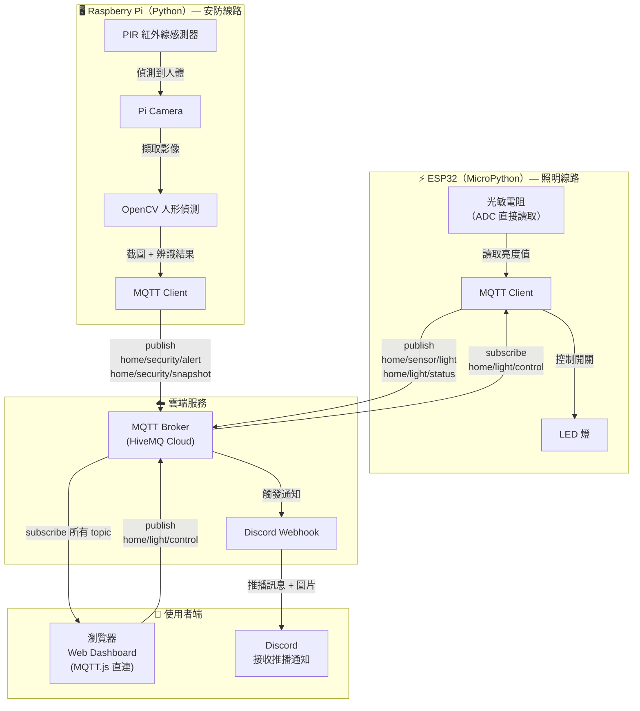
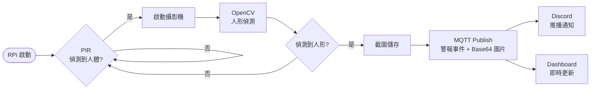
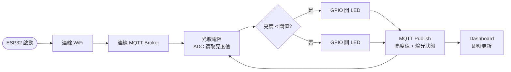
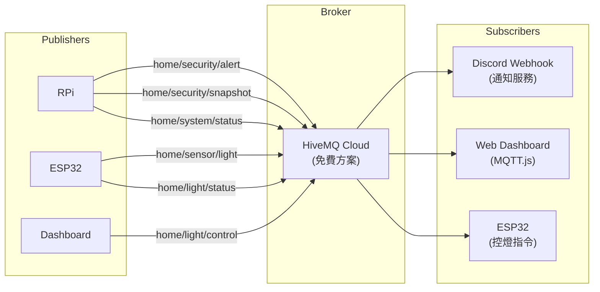

# AIoT 智慧安防與環境感測系統 — 期末專題計畫書

## 一、專題名稱

**AIoT 智慧安防與環境感測系統**
基於 Raspberry Pi + ESP32 的人體偵測、即時監控與自動照明控制平台

---

## 二、專題動機與目的

隨著物聯網（IoT）技術的普及，智慧家庭安防已成為重要應用領域。本專題旨在利用 Raspberry Pi 與 ESP32 雙裝置架構，建構一套具備以下功能的 AIoT 系統：

1. **入侵偵測與警報通知（RPi）**：透過紅外線感測器偵測人體，自動啟動攝影機並以 OpenCV 進行影像辨識，將截圖透過 MQTT 傳送至雲端，並推播通知至 Discord
2. **環境亮度自動控制（ESP32）**：透過光敏電阻偵測環境亮度（ESP32 內建 ADC 直接讀取），當亮度低於閾值時自動開燈
3. **Web 監控儀表板**：透過 MQTT.js 直連雲端 Broker，提供即時感測數據與手動控制介面

---

## 三、系統架構

### 3.1 架構總覽



### 3.2 系統流程圖

#### 線路一：安防偵測流程（RPi）



#### 線路二：自動照明流程（ESP32）



### 3.3 MQTT 通訊架構



---

## 四、硬體需求

| 元件 | 數量 | 負責裝置 | 用途 | 狀態 |
|------|------|---------|------|------|
| Raspberry Pi 4/5 | 1 | — | 安防線路主控 | ✅ 已有 |
| ESP32 | 1 | — | 照明線路主控 | ✅ 已有 |
| USB Webcam | 1 | RPi | 影像擷取 | ✅ 已有 |
| PIR 紅外線感測器 (HW-456 SR505) | 1 | RPi | 人體偵測 | ✅ 已有 |
| 光敏電阻 (LDR) | 1 | ESP32 | 亮度偵測（ADC 直讀） | ✅ 已有 |
| LED | 1 | ESP32 | 照明（MVP 替代繼電器+燈） | ✅ 已有 |
| 麵包板 + 杜邦線 | 1組 | — | 電路連接 | ✅ 已有 |

---

## 五、軟體技術棧

| 層級 | 技術 | 裝置 | 說明 |
|------|------|------|------|
| 程式語言 | Python 3 | RPi | 安防線路主要語言 |
| 程式語言 | MicroPython | ESP32 | 照明線路，與 RPi 統一 Python |
| 影像辨識 | OpenCV | RPi | 人形偵測（HOG + SVM） |
| 攝影機驅動 | picamera2 / OpenCV VideoCapture | RPi | 擷取影像 |
| GPIO 控制 | RPi.GPIO / gpiozero | RPi | PIR 感測器讀取 |
| ADC 讀取 | machine.ADC | ESP32 | 光敏電阻直接讀取（內建 ADC） |
| MQTT Client | paho-mqtt | RPi | 發布/訂閱訊息 |
| MQTT Client | umqtt.simple | ESP32 | MicroPython MQTT 函式庫 |
| MQTT Broker | HiveMQ Cloud（免費） | 雲端 | 雲端 MQTT 中繼，支援外網存取 |
| Web 前端 | HTML/CSS/JS + Tailwind + MQTT.js | 瀏覽器 | 監控儀表板（純靜態，不需後端） |
| 推播通知 | Discord Webhook | RPi | 警報推播 |

---

## 六、MQTT Topic 設計

| Topic | 發布者 | 訂閱者 | Payload 格式 | 說明 |
|-------|--------|--------|-------------|------|
| `home/security/alert` | RPi | Dashboard, Discord | `{"timestamp": "...", "confidence": 0.85}` | 入侵警報 |
| `home/security/snapshot` | RPi | Dashboard, Discord | `{"timestamp": "...", "image": "<Base64>"}` | 截圖影像 |
| `home/sensor/light` | ESP32 | Dashboard | `{"value": 2048, "lux": 120}` | 亮度數值 |
| `home/light/status` | ESP32 | Dashboard | `{"status": "on"}` | 燈光狀態 |
| `home/light/control` | Dashboard | ESP32 | `{"action": "on"}` or `{"action": "off"}` | 遠端控燈 |
| `home/system/status` | RPi | Dashboard | `{"uptime": "...", "cpu_temp": 45}` | 系統狀態 |

---

## 七、前端 Dashboard 功能規劃

| 功能 | 資料來源 | 說明 |
|------|---------|------|
| 即時截圖顯示 | MQTT `home/security/snapshot` | Base64 圖片即時渲染 |
| 警報事件列表 | MQTT `home/security/alert` | 即時顯示入侵警報紀錄 |
| 亮度數值顯示 | MQTT `home/sensor/light` | ESP32 即時亮度數據 |
| 燈光狀態 + 控制按鈕 | MQTT `home/light/status` + `control` | 顯示狀態 + 手動開關燈 |
| 系統狀態 | MQTT `home/system/status` | RPi CPU 溫度、運行時間 |

---

## 八、開發時程

| 階段 | 工作內容 | 裝置 | 硬體需求 | 預估天數 |
|------|---------|------|---------|---------|
| **Phase 1** | 專案初始化（目錄結構、設定檔、依賴） | — | 無 | 0.5 天 |
| **Phase 2** | MQTT 核心模組 + HiveMQ Cloud 連線 | RPi | 無（電腦測試） | 0.5 天 |
| **Phase 3** | ESP32 照明線路（光敏+LED+MQTT） | ESP32 | ✅ 已有 | 1 天 |
| **Phase 4** | Discord Webhook 通知模組 | RPi | 無 | 0.5 天 |
| **Phase 5** | 安防線路（PIR+攝影機+OpenCV） | RPi | ❌ 等到貨 | 1-2 天 |
| **Phase 6** | 前端 Dashboard（Tailwind+MQTT.js） | — | 無 | 1-2 天 |
| **Phase 7** | RPi 主程式整合 | RPi | 部分 | 0.5 天 |
| **Phase 8** | 全系統整合測試 + 除錯 | 全部 | 全部 | 1 天 |
| **合計** | | | | **6-8 天** |

---

## 九、預期成果

1. 紅外線偵測到人體 → 自動拍照 → Discord 收到警報通知（含截圖）
2. 環境亮度不足 → ESP32 自動開 LED；亮度恢復 → 自動關 LED
3. Web Dashboard 即時查看截圖、感測數據、遠端控制燈光
4. 支援外網存取（透過 HiveMQ Cloud MQTT Broker）
5. RPi + ESP32 雙裝置透過 MQTT 協同運作

---

## 十、專案目錄結構（規劃）

```
AIOT_final/
├── PROJECT_PLAN.md            # 計畫書
├── requirements.txt           # RPi Python 套件
├── .env.example               # 敏感資訊模板
├── .gitignore
├── config.py                  # RPi 設定檔
├── main.py                    # RPi 主程式入口
│
├── sensors/                   # RPi 感測器模組
│   └── pir.py                 # PIR 紅外線
│
├── camera/                    # RPi 攝影機模組
│   ├── capture.py             # 攝影機擷取
│   └── detector.py            # OpenCV 人形偵測
│
├── mqtt/                      # RPi MQTT 模組
│   └── client.py              # MQTT 連線封裝
│
├── notify/                    # RPi 通知模組
│   └── discord_bot.py         # Discord Webhook
│
├── web/                       # 前端 Dashboard（靜態）
│   └── index.html             # 單頁 Dashboard（Tailwind + MQTT.js）
│
├── esp32/                     # ESP32 MicroPython 程式
│   ├── boot.py                # WiFi 連線
│   ├── main.py                # 主程式（光敏+LED+MQTT）
│   ├── config.py              # ESP32 設定（WiFi、MQTT、GPIO）
│   └── lib/
│       └── umqtt_simple.py    # MQTT 函式庫
│
└── snapshots/                 # 截圖儲存目錄
```
